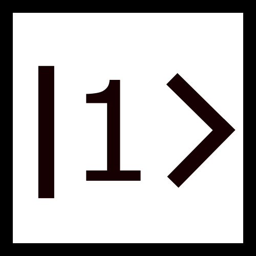

**Psitrum** is an open-source software that allows the user to design, implement and simulate quantum circuits. Then, it gives the user a variety of visualization tools that help to understand and analyze the results. **Psitrum** simulate the process of universal quantum computers. 

## Psitrum Services
**Psitrum** allows the user:
- to design a quantum circuit with as many qubit and as many operations as possible.
- to visualize the output of a quantum circuit
- to introduce different types of noise to quantum circuits
- to provide visualization tools (e.g. Bloch Sphere)
- to trace out the quantum state of each qubit after each stage
- to import and export quantum circuits.

## Psitrum Repository

**Psitrum** repository contains three components:
1. Psitrum Installation Files {Psitrum_Installation}
2. Psitrum MATLAB source codes {Psitrum_Code}
3. Psitrum documentations and designing files {Documentation}

## Installation
You can download **Psitrum** by three ways:
### Psitrum: Standalone App
This is the easiest method to use Psitrum. You can install the app by following those steps:
1. Download the installer file (PsitrumInstaller)
2. Follow the installation instruction of the installer
3. Start using Psitrum

### **Psitrum**: MATLAB App
By this method you can add **Psitrum** as an App in your MATLAB:
1. Download the MATLAB app installer (Psitrum.mlappinstall)
2. Open MATLAB in your computer and go the Apps section
3. Click on "Install App" and chose the downloaded file
4. Now, it will be installed and you can find it in "My Apps" section
5. Run Psitrum

### Psitrum: App Designer
You can use this method if you want to access the code of Psitrum and start to modify the software:
1. Download the Code file (PsitrumCode) as .zip extension
2. Unzip the file and save it wherever you want
3. Open MATLAB in your computer
4. Change the "Current Folder" into the downloaded file
5. Now, you can find the functions of **Psitrum** and other folders 
6. Open the file (Psitrum.mlapp) to access the App designer of **Psitrum**
7. You can start learning and developing Psitrum code

## What does Psitrum do ?
**Psitrum** simulates the functionality of a universal quantum computer. The following flow chart shows the location of **Psitrum** in the map of quantum computing.

## How to design a Quantum Circuit ?
**Psitrum** is using a circuit-model or gate-model to design the quantum circuits. This models contains four sections. 
The following figure encapsulates the idea.

## Example to start with
You can start using **Psitrum** with the following example:

### Full Adder Circuit

## What are the quantum gates provided ?
**Psitrum** provide a variety of quantum gate that you can use in your design. Those gates are consistent with the ones that are used in popular simulators (i.e. IBM qiskit).

                                                

## Visit Our Website

You can follow our Psitrum news and updates on this website: ([Psitrum Website](https://github.com/MoGhadeer/Psitrum.git)).

## Authors

The Authors of Psitrum are:
- Mohammed Alghadeer {[GitHub](https://github.com/MoGhadeer)} {Email: Modghadeer@gmail.com}
- Eid Aldawsari {[GitHub](https://github.com/EidFAldawsari)} {Email: EidFAldawsari@gmail.com}
